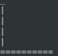

# [Pendu_py3](https://github.com/lostsh/Pendu_py3/)

Ceci est en pendu, en `python3`.

L'objectif étant de deviner le mot en moins de *10 essais*.


## Fonctionnement 

Lancer le jeux :

```bash
python3 pendu.py
# Ou encore 
py pendu.py
```

## Jeux


 
